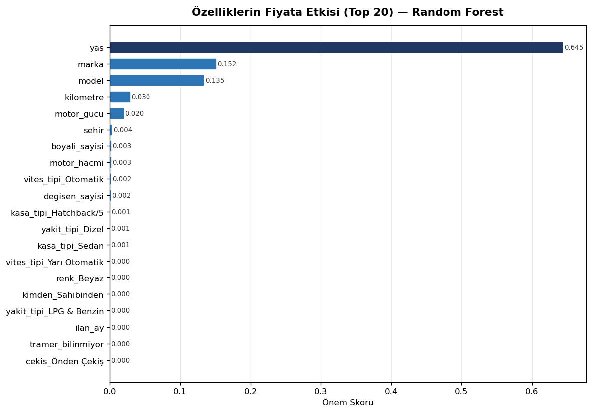
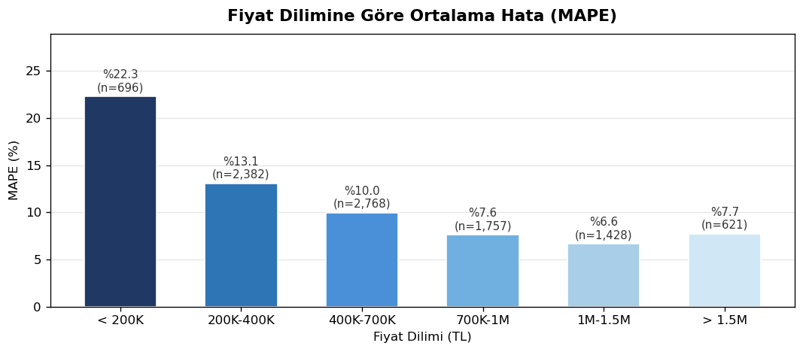
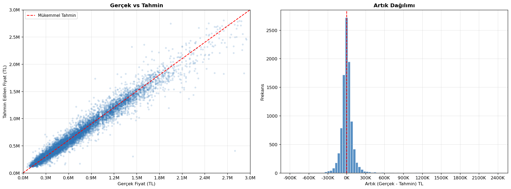

# Araç Fiyat Tahmin Modeli

Türkiye'deki ikinci el araç fiyatlarını tahmin etmeye yönelik bir makine öğrenmesi projesidir. Random Forest algoritması kullanılmıştır.

## Veri Seti

Kaggle üzerinden erişilebilir:
[Cars in Turkey — Kaggle](https://www.kaggle.com/code/lucasscheffer01/carsinturkey/input)

## Dosyalar

| Dosya | Açıklama |
|-------|----------|
| `veriseti.xlsx` | Ham veri seti |
| `verisetiTemiz2.xlsx` | Temizlenmiş veri seti |
| `VeriTemizleme.ipynb` | Veri temizleme adımları |
| `ModelEgitimi.ipynb` | Model eğitimi ve değerlendirme |

## Kullanılan Özellikler

`marka`, `model`, `yıl`, `km`, `vites_tipi`, `yakit_tipi`, `kasa_tipi`, `renk`, `cekis`, `kimden`, `tramer_kategori`, `sehir`

## Sonuçlar

### Özellik Önemi

### MAPE Dilim Analizi

### Genel Grafik

## Kullanılan Kütüphaneler

- pandas, numpy
- scikit-learn (RandomForestRegressor)
- matplotlib, seaborn
